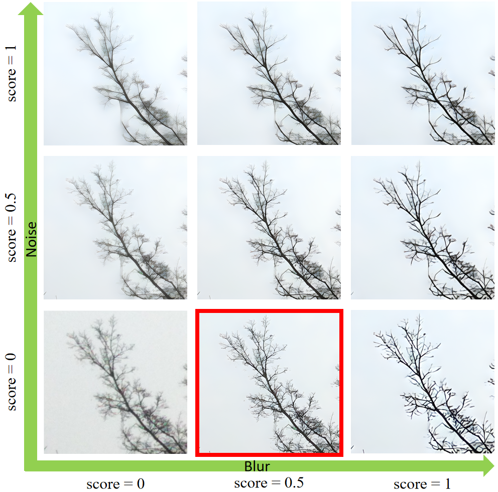
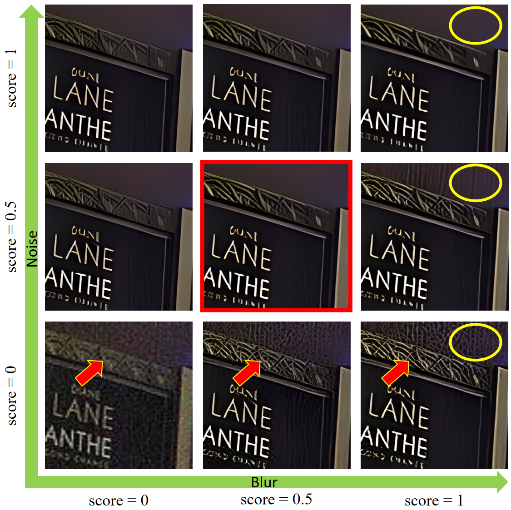

### 📖 MM-RealSR: Metric Learning based Interactive Modulation for Real-World Super-Resolution

> [[Paper](https://arxiv.org/abs/2205.05065)]<br>
>[Chong Mou](https://scholar.google.com.hk/citations?user=SYQoDk0AAAAJ&hl=en), Yanze Wu, [Xintao Wang](https://xinntao.github.io/), [Chao Dong](https://scholar.google.com.hk/citations?user=OSDCB0UAAAAJ), [Jian Zhang](https://jianzhang.tech/), [Ying Shan](https://scholar.google.com/citations?user=4oXBp9UAAAAJ&hl=en) <br>
> [Tencent ARC Lab](https://arc.tencent.com/en/ai-demos/imgRestore); Shenzhen Institutes of Advanced Technology, Chinese Academy of Sciences

<p align="center">
  
</p>

---

## 🔧 Dependencies and Installation

- Python >= 3.7 (Recommend to use [Anaconda](https://www.anaconda.com/download/#linux) or [Miniconda](https://docs.conda.io/en/latest/miniconda.html))
- [PyTorch >= 1.7](https://pytorch.org/)

### Installation

1. Clone repo

    ```bash
    git clone https://github.com/TencentARC/MM-RealSR.git
    cd MM-RealSR
    ```

1. Install dependent packages

    ```bash
    # Install basicsr - https://github.com/xinntao/BasicSR
    # We use BasicSR for both training and inference
    pip install basicsr
    # facexlib and gfpgan are for face enhancement
    pip install facexlib
    pip install gfpgan
    pip install -r requirements.txt
    python setup.py develop
    ```

---

### Training

```bash
python -m torch.distributed.launch --nproc_per_node=4 --master_port=4321 mmrealsr/train.py -opt options/MMRealSRNet_x4.yml --launcher pytorch --auto_resume

python -m torch.distributed.launch --nproc_per_node=4 --master_port=4321 mmrealsr/train.py -opt options/MMRealSRGAN_x4.yml --launcher pytorch --auto_resume
```

### Model Zoo

Please download checkpoints from [Google Drive](https://drive.google.com/file/d/10EyZR0SBEXkZIag9rcSgYBupBGllcwdA/view?usp=sharing).


#### Inference general images

Inference!

```bash
python inference_mmrealsr.py -opt (path to .yml file) --im_path (path to LR images) --model_path (path to checkpoint) --res_path (path to save SR images)

python Metric/LPIPS.py --folder_gt (path to HR images) --folder_restored (path to SR images)

python Metric/NIQE.py --folder_restored (path to SR images)

python Metric/DISTS.py --folder_gt (path to HR images) --folder_restored (path to SR images)
```

Results are in the `results` folder

#### Generate video demos

```bash
python inference_mmrealsr_demo.py -opt (path to .yml file) --model_path (path to checkpoint)
```

## BibTeX

    @InProceedings{mou2022mmrealsr,
        author    = {Chong Mou and Yanze Wu and Xintao Wang and Chao Dong and Jian Zhang and Ying Shan},
        title     = { Metric Learning based Interactive Modulation for Real-World Super-Resolution},
        booktitle = {European Conference on Computer Vision (ECCV)},
        date      = {2022}
    }

## 📧 Contact

If you have any question, please email `eechongm@gmail.com`.

## 🤗 Acknowledgement

Thanks to the following open-source projects:

- [Real-ESRGAN](https://github.com/xinntao/Real-ESRGAN).
- [CResMD](https://github.com/hejingwenhejingwen/CResMD).
- [CUGAN](https://github.com/HaomingCai/CUGAN).
